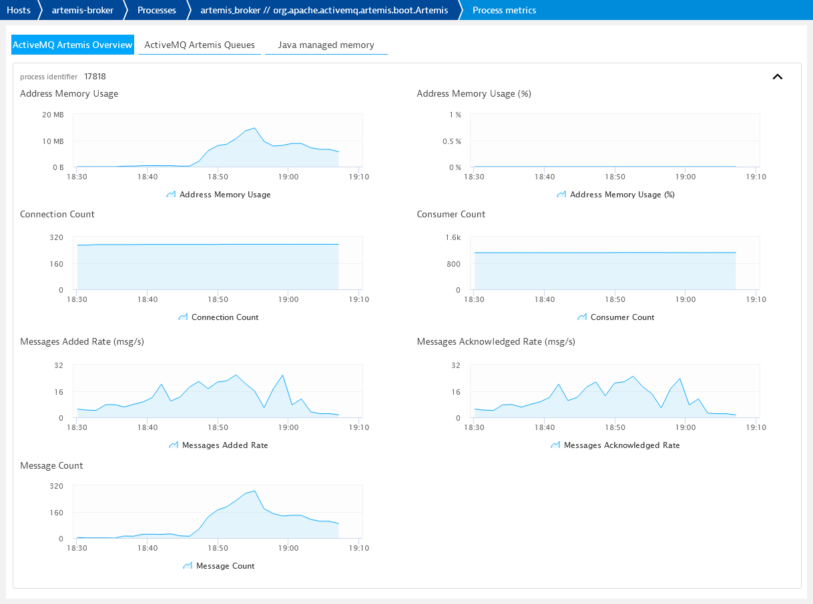
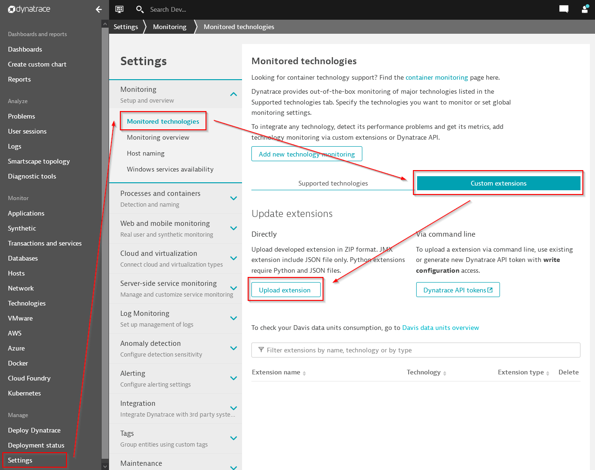

# ActiveMQ Artemis plugins for Dynatrace

[](https://github.com/vegardit/activemq-artemis-dynatrace-plugin/actions?query=workflow%3A%22Build%22)
[](#license)
[](CODE_OF_CONDUCT.md)

1. [About](#about)
1. [Installation](#install)
1. [Update](#update)
1. [References](#references)
1. [License](#license)


## <a name="about"></a>About

Custom [Dynatrace](https://www.dynatrace.de/) [JMX](https://en.wikipedia.org/wiki/Java_Management_Extensions) plugins for [ActiveMQ Artemis](https://github.com/apache/activemq-artemis) broker processes.

### Artemis Overview Plugin

This plugin provides general broker statistics such as address memory usage, connection/consumer count, total message count, total messages added/acknowledged rate.



### Artemis Queues Plugin

This provides detailed per-queue statistics such as current message count, messages added/acknowledged rate, consumer counts.

**IMPORTANT:** Activating the **Artemis Queues Plugin** on brokers with a VERY large number of queues may result in an overload of the broker process (100% CPU usage, denial of service) caused by the thousands of periodic JMX requests made by Dynatrace.


## <a name="install"></a>Installation

1. You can download the latest version of the plugins here:
   * [artemis-overview-plugin-latest.zip](https://github.com/vegardit/activemq-artemis-dynatrace-plugin/releases/download/latest/artemis-overview-plugin-latest.zip)
   * [artemis-queues-plugin-latest.zip](https://github.com/vegardit/activemq-artemis-dynatrace-plugin/releases/download/latest/artemis-queues-plugin-latest.zip)

2. The plugin zip file can then be installed via **Manage > Settings > Monitoring > Monitored Technologies > Custom extensions > Upload extension**




## <a name="update"></a>Update

The plugins can be updated via: **Manage > Settings > Monitoring > Monitored Technologies > Custom extensions >**
- **ActiveMQ Artemis Overview > Upload extension**
- **ActiveMQ Artemis Queues > Upload extension**


## <a name="references"></a>References

- [How to monitor JMX metrics in Java applications](https://www.dynatrace.com/support/help/extend-dynatrace/jmx-plugins/how-to-monitor-jmx-metrics-in-java-applications/)
- [Example JMX plugins](https://github.com/Dynatrace/JMX-Extensions)
- [Dynatrace Plugin SDK](https://dynatrace.github.io/plugin-sdk/index.html)
   - [Plugin.json reference](https://dynatrace.github.io/plugin-sdk/api/plugin_json_apidoc.html)
   - [Plugin Lifecycle / Activation](https://dynatrace.github.io/plugin-sdk/plugin_lifecycle/index.html#plugin-activation)
   - [Known Technologies](https://dynatrace.github.io/plugin-sdk/api/known_technologies.html)
   - [Known Process Types](https://dynatrace.github.io/plugin-sdk/api/known_process.html)
- Artemis MBeans:
   - [ActiveMQServerControl](https://github.com/apache/activemq-artemis/blob/master/artemis-core-client/src/main/java/org/apache/activemq/artemis/api/core/management/ActiveMQServerControl.java)
   - [QueueControl](https://github.com/apache/activemq-artemis/blob/master/artemis-core-client/src/main/java/org/apache/activemq/artemis/api/core/management/QueueControl.java)


## <a name="license"></a>License

All files are released under the [Apache License 2.0](LICENSE.txt).

Individual files contain the following tag instead of the full license text:
```
SPDX-License-Identifier: Apache-2.0
```

This enables machine processing of license information based on the SPDX License Identifiers that are available here: https://spdx.org/licenses/.
